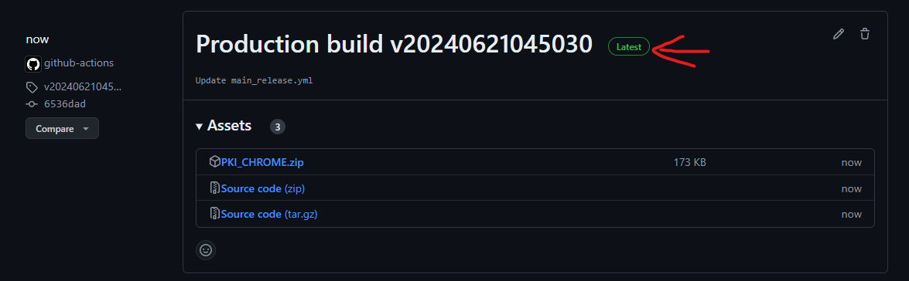
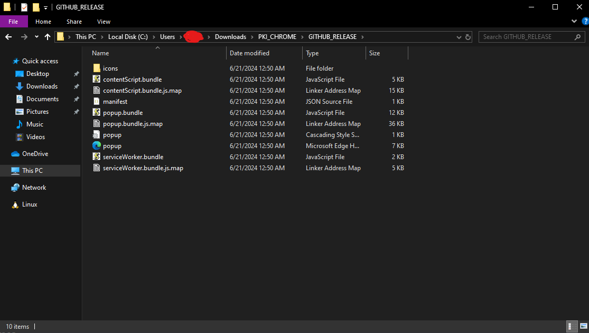
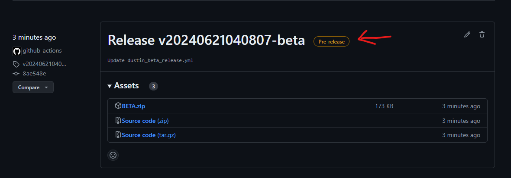

# pki-chrome

## General Users

For general users, getting the latest version is simple.

Simply navigate to the [releases](https://github.com/akhargha/pki-chrome/releases) tab.

Then, just grab the latest release with the label `Latest`.

Download the zip file and extract it. Then open the folder.

You should find another folder, that folder is the one you want to use when installing the extension. This folder contains all the extension contents, such as the manifest file.

The contents of the folder should look like this.

Load this folder when installing your extension into the relevant browser.

For instructions on how to install the extension, go [here](#loading-the-extension)

## For Testers

For testers, getting the latest version is simple.

Simply navigate to the [releases](https://github.com/akhargha/pki-chrome/releases) tab.

If you want the latest in development version, look for the latest release with the `Pre-release` label.

The rest of the installation is the same as stated above in [General Users](#general-users)

## BUILDING
### Requirements

Since this is a javascript project, you'll need node.js installed. 

This is essential to running webpack, which will compile the extension.

You can find nodejs at [this link](https://nodejs.org/en). 

I recommend installing the latest version, which at the time of writing is `Node.js v20.14.0`

### Installing

After cloning the github repo to your respective folder, and installing Node.js, you first want to install all the necessary modules.

You may do this by calling `npm install` in your the base directory.

After that, compiling the program is as simple as running `npm run build` to build a production version of the extension.

**developers may want to build the dev version instead using `npm run dev`!**

You should be all set after that.

### Loading the Extension

Go to 'Extension' in Chrome-

Then check on the developer's mode on the top right conrner.

Then, click on 'Load Unpacked'-

Finally, select the `dist` directory (or whatever directory your manifest is in) as your target folder.
